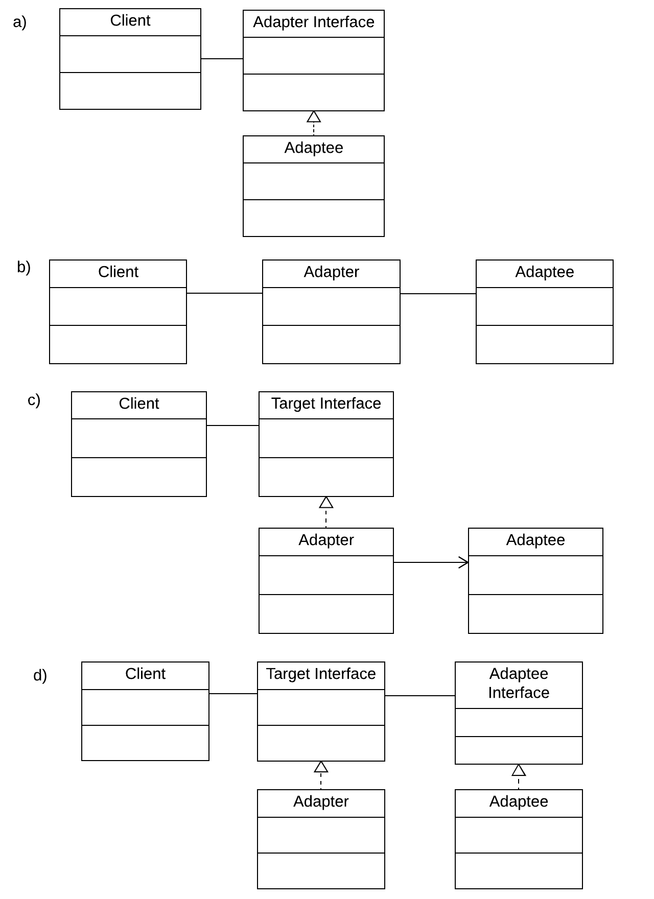

```
  # Do not copy if you are taking the test.
```
--- 

# Module 1 Review 


### 01. When is the best time to use a design pattern? Choose two answers.

- [ ] For a problem that is unique to your program. 
- [x] For a commonly-encountered issue.  
- [ ] When fixing spaghetti code 
- [x] When explaining a solution to your fellow developers 


### 02. What is the purpose of the Singleton pattern? Select the two correct answers.

- [ ] to provide simple classes with only one method  
- [x] to provide global access to an object 
- [ ] to enforce collaboration of a class with only one other class  
- [x] to enforce instantiation of only one object of a class  

### 03. What does it mean to "let the subclass decide" in the Factory Method Pattern?
  
- [ ] the subclass will pass a parameter into a factory that determines which object is instantiated.  
- [x] the subclass defines the methods for concrete instantiation. As such, the type of object is determined by which subclass is instantiated.  
- [ ] the subclass decides which object to create, but calls a method that is defined in the superclass to instantiate the class


### 04. What do we call the creation of an object, for example, with the 'new' operator in Java?
  
- [ ] manifestation   
- [ ] object realization   
- [x] concrete instantiation.  
- [ ] class creation 


### 05. What are the advantages of the Facade pattern? Select the three correct answers.
  
- [x] The client and the subsystem are more loosely coupled   
- [x] The complexity of the subsystem is hidden   
- [ ] The subsystem can handle more clients  
- [x] The Facade class redirects requests as needed 


### 06. Which of the following diagrams shows the Adapter pattern?

  
- [ ] a) 
- [ ] b)  
- [x] c)   
- [ ] d)  


### 07. Which of these are the best applications for a Composite Pattern? Choose the three correct answers.
   
- [x] Music in a playlist   
- [x] Elements in a user-interface dialog    
- [ ] Students in a class    
- [x] Files and folders 


### 08. Which of these is NOT a common application of the Proxy Pattern?
   
- [ ] protection proxy   
- [x] information proxy   
- [ ] remote proxy    
- [ ] virtual proxy 


### 09. How does a Decorator Pattern work? Choose one.
   
- [ ] expands the methods of a class with inheritance   
- [x] builds a behaviour by stacking objects    
- [ ] adding features to a class with a new class   
- [ ] encapsulates a class to give it a different interface 


### 10. What are the object types that are used in the Composite Pattern? Select the two correct answers.
   
- [ ] trunk   
- [x] composite   
- [x] leaf    
- [ ] branch    
- [ ] root 


### 11. Many different clients need to create a similar object. You would like to outsource this concrete instantiation to a dedicated class. Which technique will you use, in one word?
```
factory
```

### 12. How do you enforce the creation of only one Singleton object? Select the two correct answers.
   
- [x] Give the Singleton class a private constructor   
- [ ] Throw an exception if a Singleton object is already instantiated    
- [x] Write a method that can create a new Singleton object or return the existing one.    
- [ ] Specify in the comments that only one Singleton object is to be instantiated.


--- 
> [Design Patterns](https://www.coursera.org/learn/design-patterns/) {Week-1}
