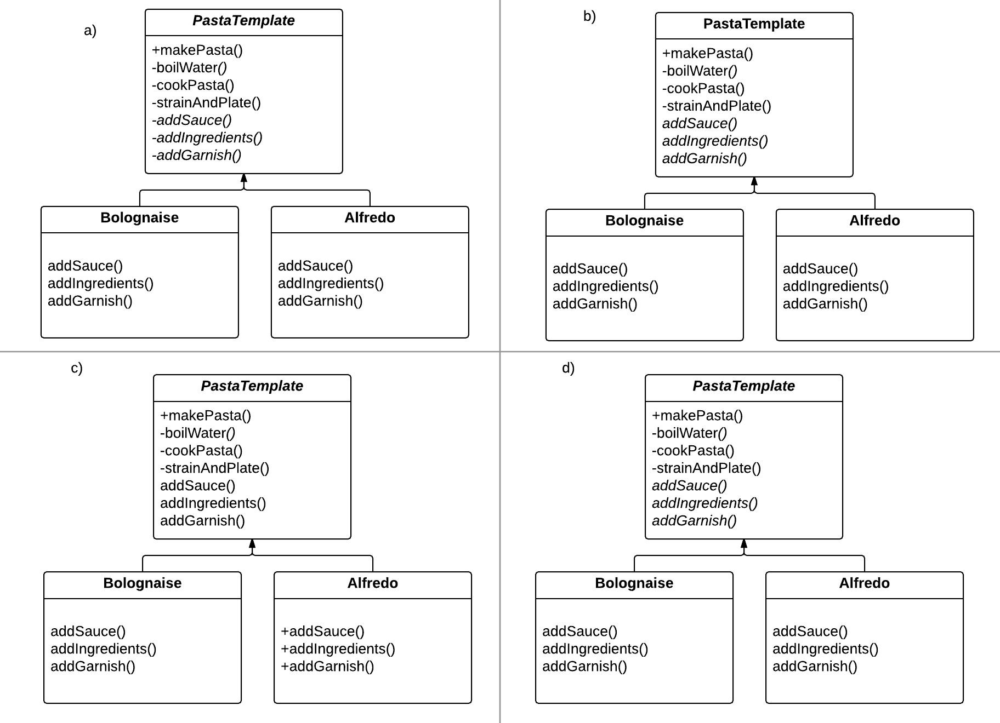
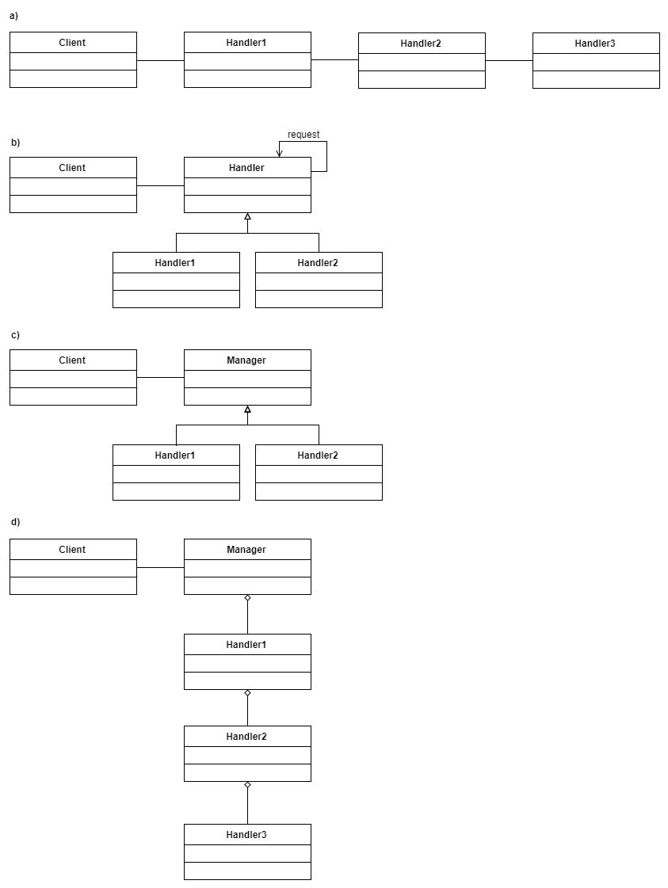

```
  # Do not copy if you are taking the test.
```
--- 

# Module 2 Review 


### 01. Choose the most appropriately implemented Template pattern.

  Some UML reminders that will help you:

  1. a private method or variable is denoted by a - as in - `boilWater()`. 
  2. a method, variable, or class that is abstract is denoted by italics (as in PastaTemplate)  
  
   
  
- [ ] a)   
- [ ] b)  
- [ ] c)  
- [x] d)

### 02. What is the correct situation for the use of a Chain of Responsibility pattern?
  
- [ ] You need a set of objects to each contribute information on responding to a request.   
- [x] You have multiple potential handlers, but only one will deal with the request.  
- [ ] You need to pass a message to multiple receivers.  
- [ ] You need to delegate a set of tasks to a hierarchy of objects.


### 03. What is the purpose of encapsulating state in an object in the State Pattern? Choose the three that are correct.
  
- [ ] it allows the current state to be copied from one instance to another   
- [x] it turns the context into a client of the state.  
- [x] it removes large conditionals that are difficult to maintain.  
- [x] it allows the current state object to decide how to achieve behaviours specific to the state of the context.  


### 04. What design principles is the Command Pattern using?
  
- [ ] Encapsulation, information hiding, loose coupling  
- [ ] Generalization, information hiding, loose coupling  
- [ ] Encapsulation, generalization, information hiding  
- [x] Encapsulation, generalization, loose coupling  


### 05. Which are the minimum requirements of the Observer pattern? Choose the three that are correct.
  
- [x] update method in observers  
- [ ] a state variable to determine if observers have been notified.  
- [x] method to notify observers   
- [x] methods to add or remove observers 


### 06. When are you most likely to need a Mediator pattern?
  
- [ ] When your class is sending a request that might be handled by one of several handlers.   
- [x] When you are coordinating the activities of a set of related classes.  
- [ ] When you have two classes with different interfaces that you must connect.   
- [ ] When you want to de-couple a class that is requesting a service from one that is providing it.


### 07. Marlon is coding part of the software that follows a similar sequence of steps. Depending on the type of object, these steps will be implemented in slightly different ways, but their order is always the same. Which design pattern could Marlon use?
  
- [x] Template pattern  
- [ ] Mediator pattern  
- [ ] Command pattern  
- [ ] State pattern  


### 08. What are the important roles in the Command Pattern?
  
- [ ] Command, Queue, Receiver  
- [x] Command, Receiver, Invoker  
- [ ] Sender, Receiver, Invoker  
- [ ] Delegate, Command, Requester   


### 09. Select the best UML class diagram representation of the Chain of Responsibility pattern.
  
   
  
- [ ] a)  
- [x] b)  
- [ ] c)  
- [ ] d)  


### 10. You have a machine performing a complex manufacturing task, with different sensors and different components of the machine represented by different classes. Which design pattern will you use to arrange the parts?
  
- [ ] Template  
- [ ] Command  
- [x] Mediator  
- [ ] Chain of Responsibility  


### 11. You have a security system class, and it has 3 modes: normal, lockdown, and open. Which pattern would you use to model the behaviour in these different modes?
  
- [ ] Template   
- [ ] Mediator   
- [ ] Observer   
- [x] State 


### 12. One of your classes represents a mailbox, while another is the owner of the mailbox. The person would like to know when new mail arrives. Which design pattern will you probably use?
  
- [ ] State   
- [ ] Command  
- [ ] Mediator   
- [x] Observer  


--- 
> [Design Patterns](https://www.coursera.org/learn/design-patterns/) {Week-2}
