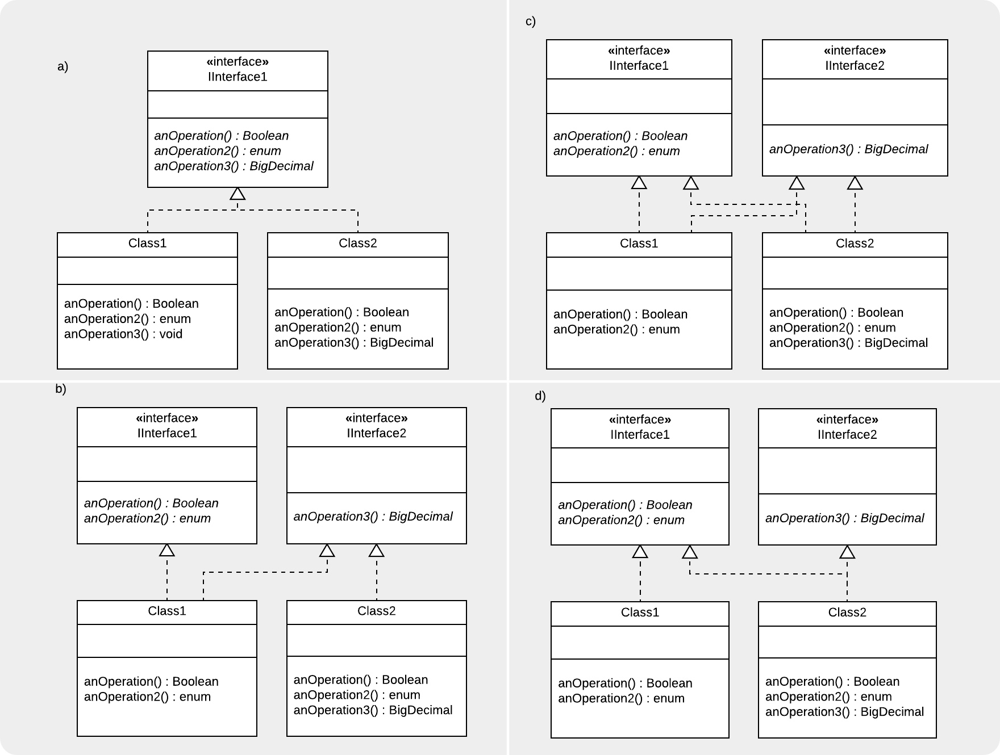

```
  # Do not copy if you are taking the test.
```
--- 

# Module 3 Review 


### 01. What does MVC Stand for? Use spaces between each word, no upper case letters, and no punctuation. 
```
model view controller
```

### 02. Select the two elements of the open/closed principle: 
  
- [ ] Closed for extension.   
- [x] Closed for modification  
- [x] Open for extension   
- [ ] Closed for maintenance.   
- [ ] Open for maintenance  
- [ ] Open for modification 


### 03. What is the best description of the Dependency Inversion principle?
   
- [ ] Service objects subscribe to their prospective client objects as Observers, watching for a request.   
- [ ] Client objects depend on an Adaptor Pattern to interface with the rest of the system.   
- [x] Client objects depend on generalizations instead of concrete objects.    
- [ ] Client objects are dependent on a service interface that directs their requests. 


### 04. Which of these statements is true about the Composing Objects principle?
   
   1. it provides behaviour with aggregation instead of inheritance   
   2. it leads to tighter coupling
   
- [x] The first statement is true   
- [ ] The second statement is true   
- [ ] Neither statement is true   
- [ ] Both statements are true


### 05. Which of these UML diagrams demonstrates the Interface Segregation principle?

   
   
- [ ] a)   
- [ ] b)   
- [ ] c)   
- [x] d)


### 06. Which of these code examples violates the Principle of Least Knowledge, or Law of Demeter?
   
- [x] Code:
```java
public class O {
	M I = new M();
	
	public void anOperation2() {
		this.I.N.anOperation();
	}
}
```
   
- [ ] Code:  
```java
public class Class1 {
  public void N() {
    System.out.println("Method N invoked");
  }
}

public class Class2 {
  public void M(Class1 P) {
    P.N();
    System.out.println("Method M invoked");
  }
}
```
   
- [ ] Code:   
```java
public class O {
		public void M() {
			this.N();
			System.out.println("Method M invoked");
		}

		public void N() {
			System.out.println("Method N invoked");
		}
}
``` 
   
- [ ] Code: 
```java
public class P {
	public void N() {
		System.out.println("Method N invoked");
	}
}

public class O {
	public void M() {
    P I = new P();
    I.N();		
		System.out.println("Method M invoked");
	}
} 		
```

### 07. How can Comments be considered a code smell?
   
- [ ] They can’t! Comments help clarify code.   
- [ ] Too many comments make the files too large to compile.   
- [x] Excessive commenting can be a coverup for bad code    
- [ ] When a comment is used to explain the rationale behind a design decision


### 08. What is the primitive obsession code smell about?
   
- [ ] Code that contains many low-level objects, without using OO principles like aggregation or inheritance.    
- [x] Overuse of primitive data types like int, long, float   
- [ ] Using many different primitive types instead of settling on a few that together capture that appropriate level of detail for your system.   
- [ ] Using key-value pairs instead of abstract data types.


### 09. You have a class that you keep adding to. Whenever you add new functionality, it just seems like the most natural place to put it, but it is starting to become a problem! Which code smell is this?
   
- [ ] Long Method    
- [x] Large Class   
- [ ] Divergent Change    
- [ ] Speculative generality 


### 10. Why is it important to avoid message chains whenever possible?
   
- [x] It's a workaround to get to private methods, which are important for encapsulation.   
- [ ] If an unexpected object is returned, this could easily lead to runtime errors.    
- [ ] They lower cohesion in your class.   
- [ ] The resulting code is usually rigid and complex. 


### 11. Look at the code snippet. Which code smell do you detect?

```java
public class Class1 {

  ...

  public void M(Class2 C) {
    C.doSomething(x);
    C.foo(y);
    C.foo2(z, i);
  }	
}
``` 

- [ ] Divergent Change   
- [ ] Long Parameter List    
- [x] Feature Envy    
- [ ] Inappropriate Intimacy 


### 12. Joseph was developing a class for his smartphone poker game, and decided that one day he would like to be able to change the picture on the backs of the cards, so he created a Deck superclass. Since his app does not have that feature yet, Deck has only one subclass, RegularDeck. What code smell is this?
   
- [ ] Primitive Obsession    
- [ ] Refused Bequest    
- [x] Speculative Generality    
- [ ] Divergent Change 


  
--- 
> [Design Patterns](https://www.coursera.org/learn/design-patterns/) {Week-3}
