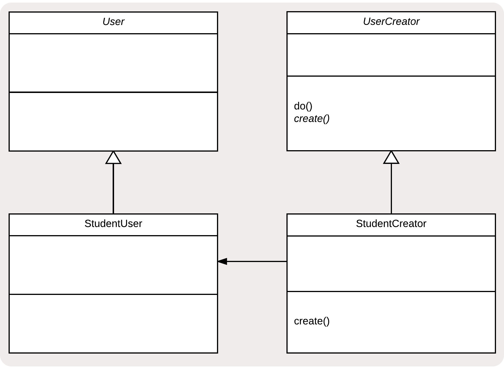
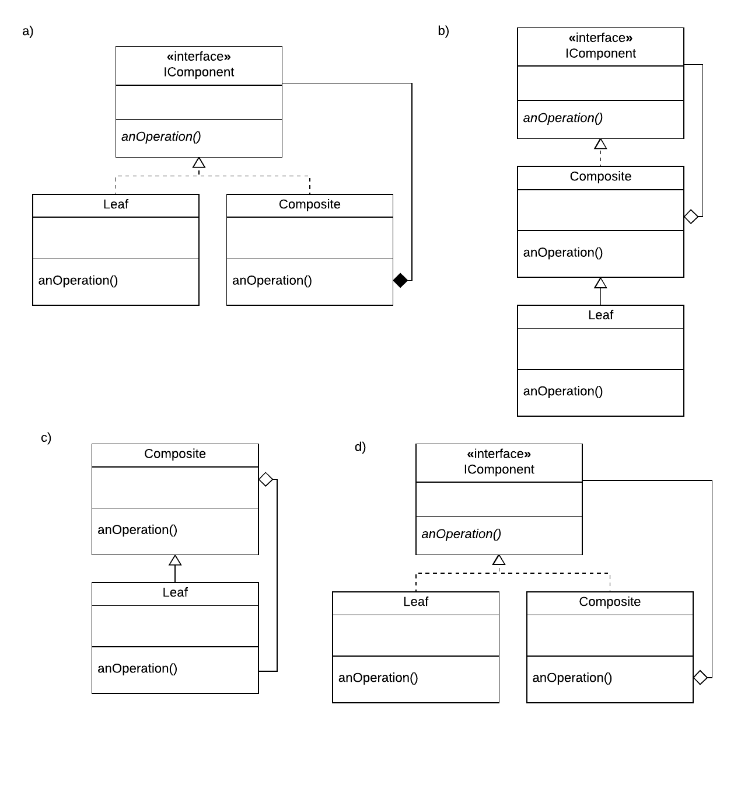
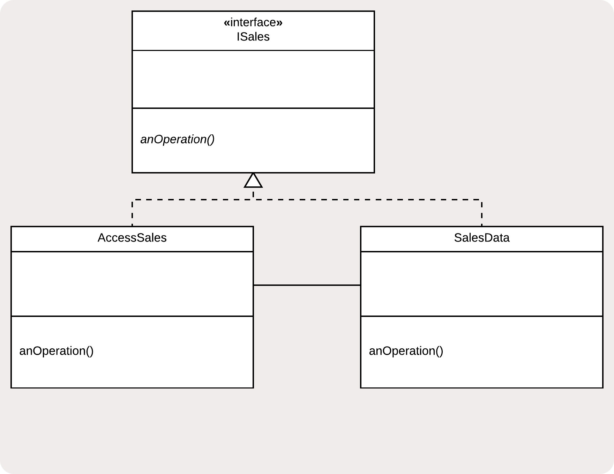
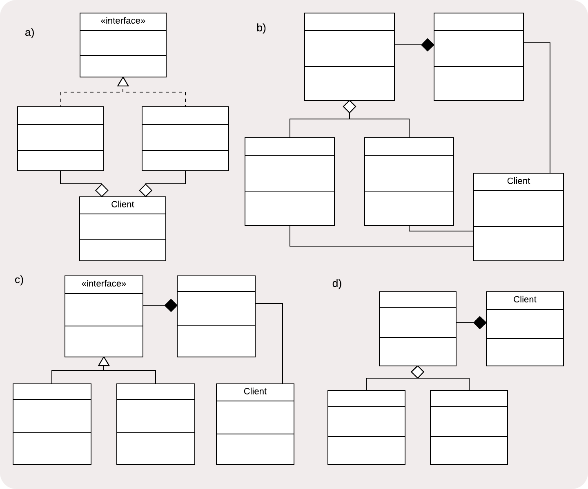
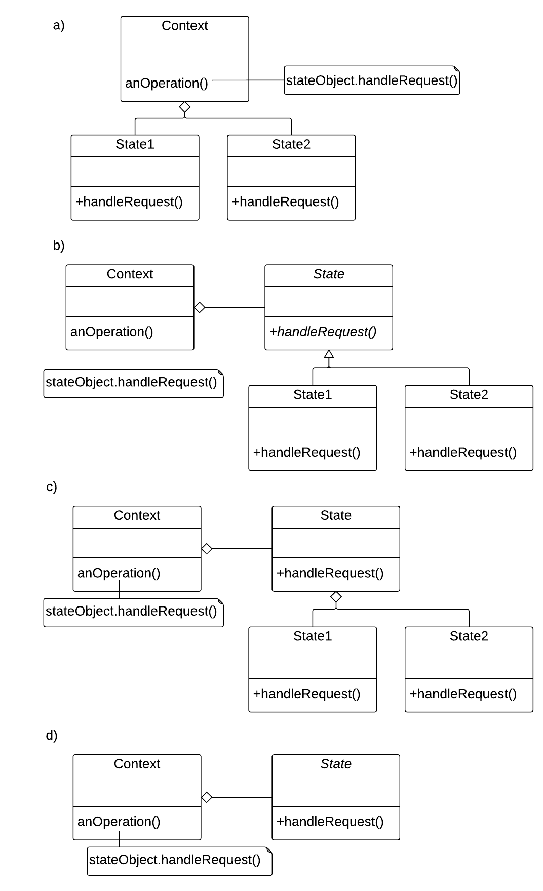
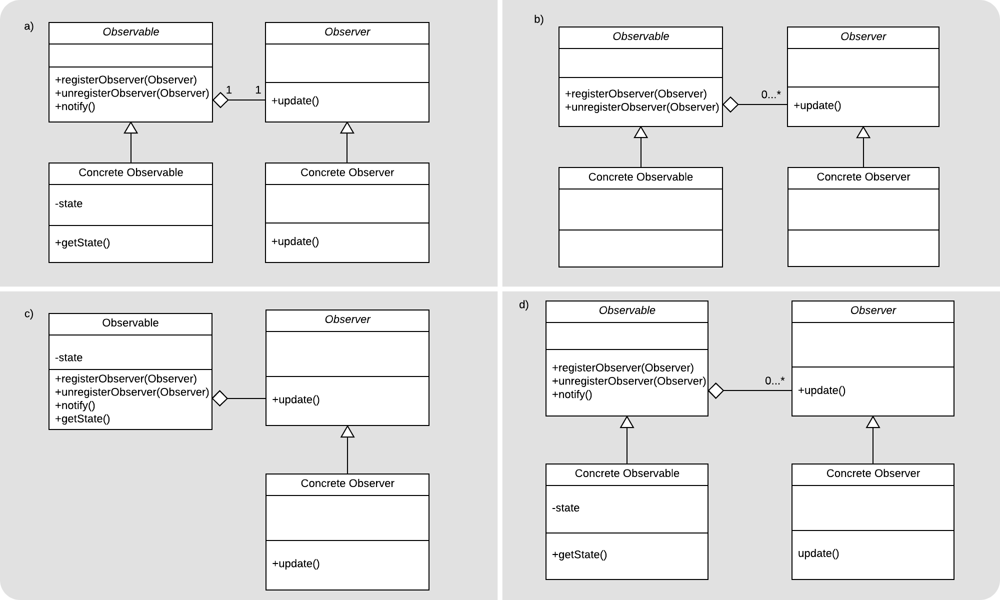
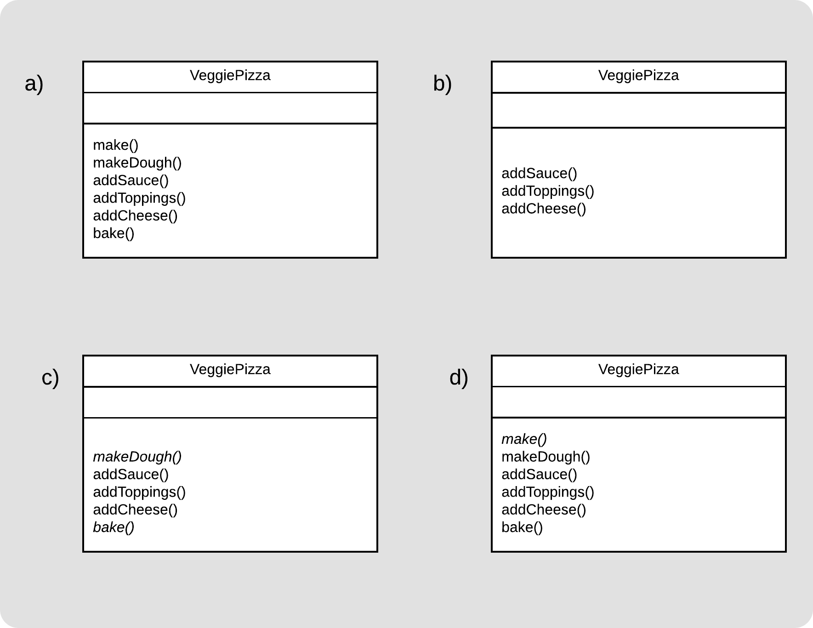

```
  # Do not copy if you are taking the test.
```
--- 

# Final Exam 


### 01. Mohsin needs to create various user objects for his University learning platform. What is the act of creating an object called?
   
- [x] concrete instantiation   
- [ ] object realization   
- [ ] class creation   
- [ ] object invocation 


### 02. Mohsin has a superclass that performs various operations on these user objects - Student, Professor, Assistant, for example. He wants the subclass to determine which object is created. This is sketched below in a UML diagram for the StudentUser class. What is this design pattern called?
   
    
   
- [ ] Template Pattern    
- [x] Factory Method Pattern   
- [ ] Simple Factory    
- [ ] Composite Pattern 


### 03. Select the correct UML class diagram representation of the Composite Pattern:
   
    
   
- [ ] a)   
- [ ] b)   
- [ ] c)   
- [x] d)


### 04. Yola is programming for a grocery store system. She has a complex SalesData class that updates inventories and tracks sales figures, and a lightweight AccessSales class that will give select sales data to a user, depending on their credentials. AccessSales delegates to SalesData when more complex data is needed. This situation is shown below. Which Pattern is this?
   
    
   
- [x] Proxy Pattern   
- [ ] Facade Pattern    
- [ ] Decorator Pattern    
- [ ] Singleton Pattern


### 05. Which of these UML class diagrams shows the Facade pattern?
   
    
   
- [ ] a)   
- [ ] b)   
- [x] c)   
- [ ] d)

   
### 06. What is the difference between the Factory Method and a Simple Factory?
   
- [ ] In the factory method pattern, the factory itself must be instantiated before it starts creating objects. This is usually done with a dedicated method.    
- [ ] A simple factory instantiates only one kind of object.    
- [ ] Simple factories cannot be subclassed.   
- [x] In Factory Method, concrete instantiation is done in a designated method, where a Simply Factory creates objects for external clients


### 07. José wants to build behaviours by stacking objects and calling their behaviours with an interface. When he makes a call on this interface, the stack of objects all perform their functions in order, and the exact combination of behaviours he needs depends what objects he stacked and in which order. Which Design Pattern best fits this need?
   
- [x] Decorator Pattern   
- [ ] Composite Pattern   
- [ ] Singleton Pattern   
- [ ] Factory Method Pattern 


### 08. You need to connect to a third-party library, but you think it might change later, so you want to keep the connection loosely coupled by having your object call a consistent interface. Which Design Pattern do you need?
   
- [x] Adapter    
- [ ] Decorator    
- [ ] Proxy    
- [ ] Facade 


### 09. Which of these diagrams shows the State pattern?
   
    
   
- [ ] a)   
- [x] b)   
- [ ] c)   
- [ ] d)


### 10. Which of these design principles best describes the Proxy pattern?
   
- [x] encapsulation, because the Proxy hides some of the detail of the subject   
- [ ] decomposition, because the Proxy object has different concerns than the subject   
- [ ] generalization, because a proxy is a general version of the real subject   
- [ ] separation of concerns, because the Proxy object has different concerns from the subject


### 11. Ashley has a method in her class that needs to makes a request. This request could be handled by one of several handlers. Which design pattern does she need?
   
- [ ] Facade   
- [ ] Decorator   
- [x] Chain of Responsibility    
- [ ] Template 


### 12. Colin is designing a class for managing transactions in software for a banking machine software. Each transaction has many of the same steps, like reading the card, getting a PIN, and returning the card. Other steps are particular to the type of transaction. Which pattern does he need?
   
- [x] Template   
- [ ] Mediator    
- [ ] State   
- [ ] MVC 


### 13. Which of these is NOT a good use of the Command pattern?
   
- [x] Sending a command to a third-party service or library   
- [ ] Building macros, for example in an image manipulation program   
- [ ] Supporting undo/redo queues of commands    
- [ ] Building a user-interface that can be used to perform operations 


### 14. Choose the correct UML class diagram representation of the Observer pattern:
   
    
   
- [ ] a)    
- [ ] b)   
- [ ] c)   
- [x] d)


### 15. Which code smell may become a problem with the Mediator design pattern?
   
- [x] Large Class   
- [ ] Refused Bequest   
- [ ] Inappropriate Intimacy    
- [ ] Speculative Generality 


### 16. Hyun-Ji is developing a program. She wants to create a Student class that behaves differently based on if the student has not registered for classes, is partially registered, fully registered, or fully registered and paid. Which design pattern does she need?
   
- [ ] Mediator    
- [ ] Template Method    
- [ ] Proxy   
- [x] State 


### 17. Which of these methods is found in a typical Observer class?
   
- [ ] addObserver()   
- [ ] getState()   
- [ ] notify()   
- [x] update() 


### 18. Fernando is making pizza objects with the Template Method pattern. The `make()` function is the whole process of making the pizza. Some steps are the same for every pizza - `makeDough()`, and `bake()`. The other steps - `addSauce()`, `addToppings()` and `addCheese()` - vary by the pizza. Which of these subclasses shows the proper way to use a template method?
   
    
   
- [ ] a)   
- [x] b)   
- [ ] c)   
- [ ] d)


### 19. In the Mediator Pattern, which pattern is often used to make sure the Mediator always receives the information it needs from its collaborators?
   
- [ ] Template Method    
- [ ] Chain of Responsibility   
- [x] Observer    
- [ ] Command


### 20. In the MVC Pattern, which of these is usually made into an Observer?
   
- [ ] Back-End   
- [ ] Controller    
- [ ] Model   
- [x] View 


### 21. Which of these answers does NOT accurately complete the following sentence? “A class is considered closed to modification when…”
   
- [ ] ...it is tested to be functioning properly    
- [ ] ...it is proven to be stable within your system   
- [ ] ...all the attributes and behaviours are encapsulated    
- [x] ...its collaborators are fixed


### 22. How does the Dependency Inversion Principle improve your software systems?
   
- [ ] Dependency becomes inverted by having the system depend on the client classes   
- [ ] Client classes become dependant on low-level concrete classes, rather than dependant on high-level generalizations   
- [ ] Client classes use an adapter to facilitate communication between itself and the rest of the system   
- [x] Client classes become dependent on high level generalizations rather than dependant on low level concrete classes


### 23. Allison has a search algorithm, and she would like to try a different implementation of it in her software. She tries replacing it everywhere it is used and this is a huge task! Which design principle could Allison have used to avoid this situation?
   
- [x] Dependency Inversion   
- [ ] Principle of Least Knowledge   
- [ ] Composing Objects Principle    
- [ ] Don't Repeat Yourself


### 24 Which of the code smells is shown in this code example of a method declaration?

```java
private void anOperation(String colour, int x, int y, int z, int speed) 
```  
- [x] Large Parameter List   
- [ ] Message Chains   
- [ ] Long Method    
- [ ] Primitive Obsession 


### 25. Which object-oriented design principle do Long Message Chains, a code smell, usually violate?
   
- [x] Principle of Least Knowledge / Law of Demeter    
- [ ] Cohesion    
- [ ] Open/Closed Principle    
- [ ] Separation of Concerns


### 26. Which code smell can you detect here?

```java
public class Person {
	int age;
	int height;
	String hairColour;

	public int getAge() { return age; }
	...

}
```   
- [ ] Feature Envy   
- [ ] Primitive Obsession    
- [x] Data Class   
- [ ] Data Clump


### 27. What are the components of the MVC pattern?
   
- [ ] Model, View, Command   
- [ ] Member, Vision, Controller   
- [ ] Model, Vision, Command   
- [x] Model, View, Controller


### 28. The interface segregation principle encourages you to use which of these object-oriented design principles? Choose the 2 correct answers.
   
- [x] decomposition    
- [ ] generalization   
- [x] abstraction    
- [ ] encapsulation


### 29. Interface Segregation is a good way to avoid which code smell? Choose the best possible answer.
   
- [x] Refused Bequest   
- [ ] Divergent Change    
- [ ] Switch Statements   
- [ ] Long Method 


### 30. Which of these statements about the Decorator pattern are true?

  1. The decorator classes inherit from the basic object which is being decorated
  2. Decorator objects can be stacked in different order
   
- [ ] The first statement is true   
- [x] The second statement is true   
- [ ] Neither statement is true   
- [ ] Both statements are true 


  
--- 
> [Design Patterns](https://www.coursera.org/learn/design-patterns/) {Week-4}
