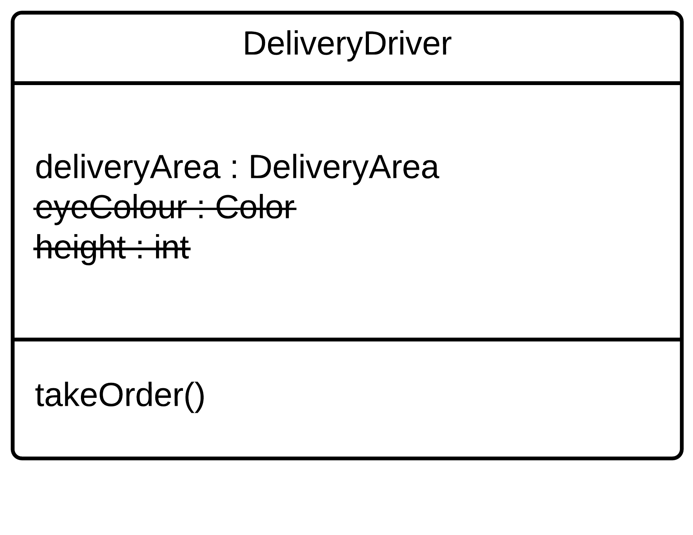
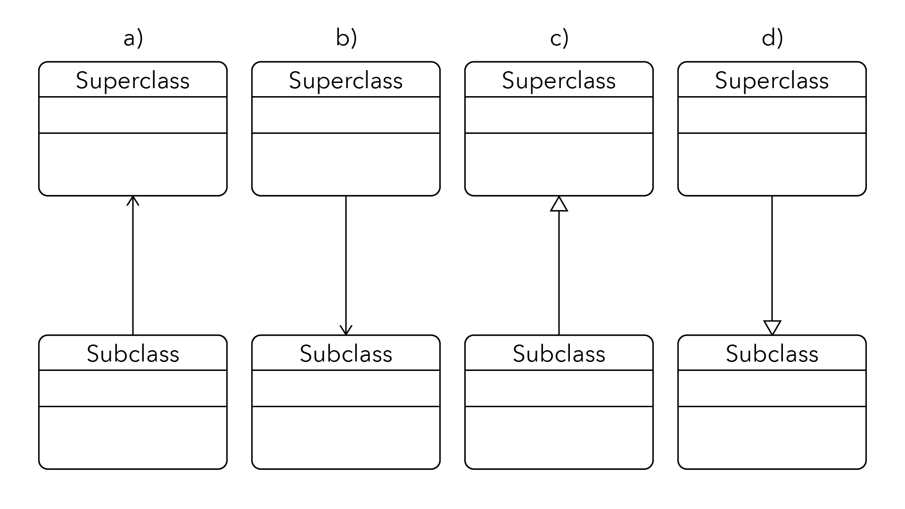
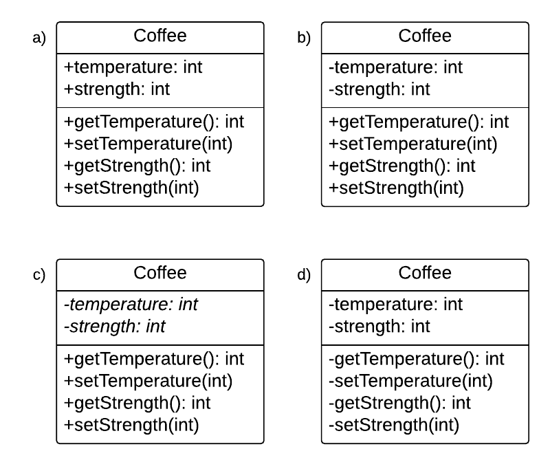

```
  # Do not copy if you are taking the test.
```
--- 

# Module 2 Review 
 

### 01. Some of the earliest computing languages supported:

- [ ] local variables 
- [ ] abstract data types 
- [x] main program and subroutines 
- [ ] objects and classes 


### 02. What are some advantages of object-oriented programming in a language like Java? Choose the three correct answers. 

- [x] abstract data types 
- [ ] computing efficiency 
- [x] data management 
- [x] mimic the real-world structure of the problem 


### 03. Sam was asked to create a DeliveryDriver class. Sam thought about the problem, and reduced it to its most essential aspects… things like takeOrder, DeliveryArea, etc. She ignored things that were not important in the context, like the driver's height or eye colour. She just applied an important object-oriented design principle. Which of these concepts best describes what she just did? 

- [ ] encapsulation 
- [x] abstraction 
- [ ] decomposition 
- [ ] generalization 


### 04. Sam identified the important attributes and behaviours of a delivery driver and put them all into a DeliveryDriver class, like "takeOrder", "deliverOrder", and "DeliveryArea." She exposed some of these to other classes. She just demonstrated an important part of object-oriented design. Which of these concepts best describes what you did? 

- [ ] decomposition 
- [ ] generalization 
- [ ] abstraction 
- [x] encapsulation 


### 05. Sam decided that the DeliveryDriver class was getting too complex, so she split it up, moving its behaviour into several related classes, like DeliveryCar and DeliveryOrder. She just demonstrated which important object-oriented design principle? 

- [ ] generalization
- [ ] abstraction
- [x] decomposition
- [ ] encapsulation 


### 06. Sam realized that her DeliveryDriver class had some behaviour and attributes that could be shared by other classes, like BusDriver and TaxiDriver, so she made a class called Driver that these classes inherited behaviour from. Which object-oriented design principle did she use? 

- [x] generalization 
- [ ] abstraction 
- [ ] encapsulation 
- [ ] decomposition 


### 07. Which keywords allow your classes to achieve polymorphism in Java? Choose the two correct answers. 

- [ ] interfaces 
- [x] implements 
- [ ] inherits 
- [x] extends 


### 08. Which is the proper way to show inheritance in a UML class diagram? Choose one of the four options below: 

- [ ] a)  
- [ ] b) 
- [x] c) 
- [ ] d) 


### 09. Which is the proper way to show an abstract method in a UML class diagram? 

- [ ] «anOperation()» 
- [x] _anOperation()_ 
- [ ] abstract anOperation() 
- [ ] #anOperation() 


### 10. Which UML class diagram is a good example of encapsulation? Choose one of the four options below: 

- [ ] a)  
- [x] b) 
- [ ] c) 
- [ ] d) 


### 11. Add the necessary keyword to complete this instance variable declaration in a class if you are using the encapsulation design principle to hide this variable from all other classes:

______ String message; 

```
private
```


### 12. There are three different relationships that objects can have. Which of these best describes the relationship between a Chair and its Legs? 

- [ ] association 
- [ ] aggregation 
- [x] composition 
- [ ] formation 

--- 
> [Object-Oriented Design](https://www.coursera.org/learn/object-oriented-design) {Week-2}
