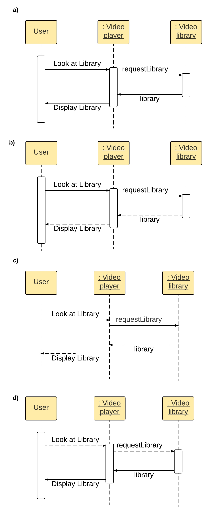
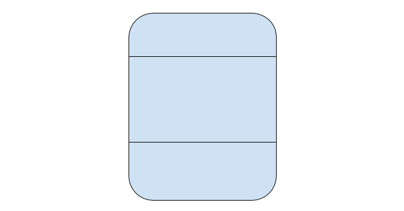

```
  # Do not copy if you are taking the test.
```
--- 

# Module 3 Review 
 

### 01. Which of these terms are used to describe coupling? Choose the 3 correct answers. 

- [x] ease 
- [ ] frequency 
- [x] flexibility 
- [x] degree 
- [ ] exposed 


### 02. Which is the most desirable? 

- [ ] low cohesion, tight coupling 
- [x] high cohesion, loose coupling 
- [ ] low cohesion, loose coupling  
- [ ] high cohesion, tight coupling 


### 03. What are some keywords you might use for information hiding in Java? Select the three correct answers. 

- [x] protected  
- [ ] abstract 
- [x] private 
- [x] [none] 


### 04. What are the best ways to promote Conceptual Integrity in your software? Choose the two correct answers. 
  
- [ ] Delegating development of different components to different teams  
- [x] Planning the architecture of the system  
- [x] Regular code reviews   
- [ ] Good commenting 


### 05. Information Hiding is closely related to one of the core design principles of object-oriented design. Which one? 
  
- [ ] generalization  
- [ ] abstraction  
- [x] encapsulation   
- [ ] decomposition 


### 06. Which of these sequence diagrams is correct? 
 
  
- [ ] a)  
- [x] b)  
- [ ] c)  
- [ ] d)  


### 07. What are elements of a state in a State diagram (see diagram)? Choose the three correct answers.  
 
  
- [x] activities  
- [x] state variables  
- [x] state name  
- [ ] events  
- [ ] responsibilities  


### 08. When is Model Checking conducted?  
  
- [x] After development  
- [ ] After deployment  
- [ ] During planning  
- [ ] During development  


### 09. What are the phases of Model Checking? Choose the 3 correct answers. 

- [x] Running Phase
- [ ] Counterexample Phase
- [ ] Model Simulation
- [x] Modeling Phase. 
- [x] Analysis Phase  


### 10. During model checking, what is the name for a violation of the desired properties of the model?  

- [x] Counterexample 
- [ ] Redevelopment  
- [ ] Error  
- [ ] Model Gap  


### 11. When two processes cannot run because they are waiting on the same resource, it's called…  
 
- [ ] Mutual lock  
- [ ] Transition lock  
- [x] Deadlock  
- [ ] State lock  


### 12. Choose the three examples of inheritance used poorly:  
  
- [x] A method in the superclass is overwritten with different behaviour by a subclass.  
- [x] Inheritance is used to share behaviour without specializing   
- [ ] The subclasses inherit methods from the superclass and have their own specific, related methods.  
- [x] A subclass inherits methods from the superclass and adds extra, new, unrelated functionality  


--- 
> [Object-Oriented Design](https://www.coursera.org/learn/object-oriented-design) {Week-3}
