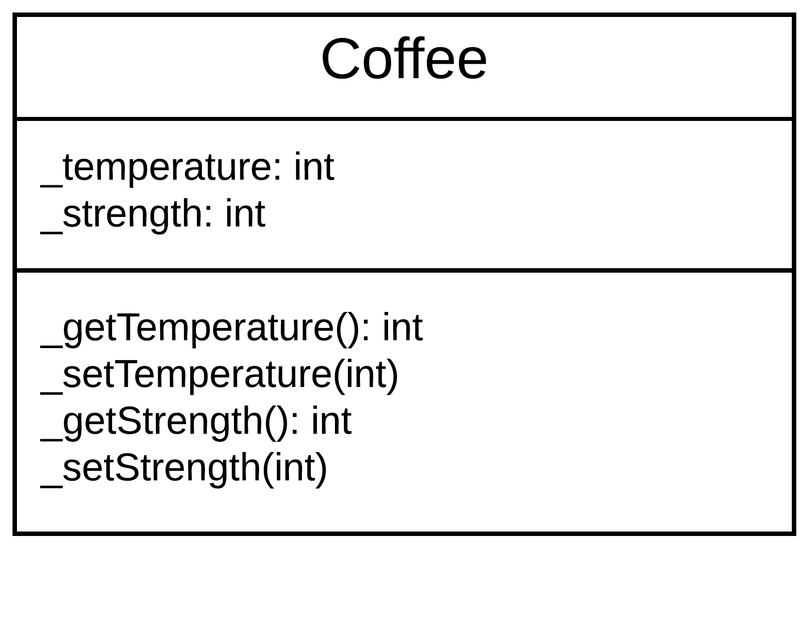
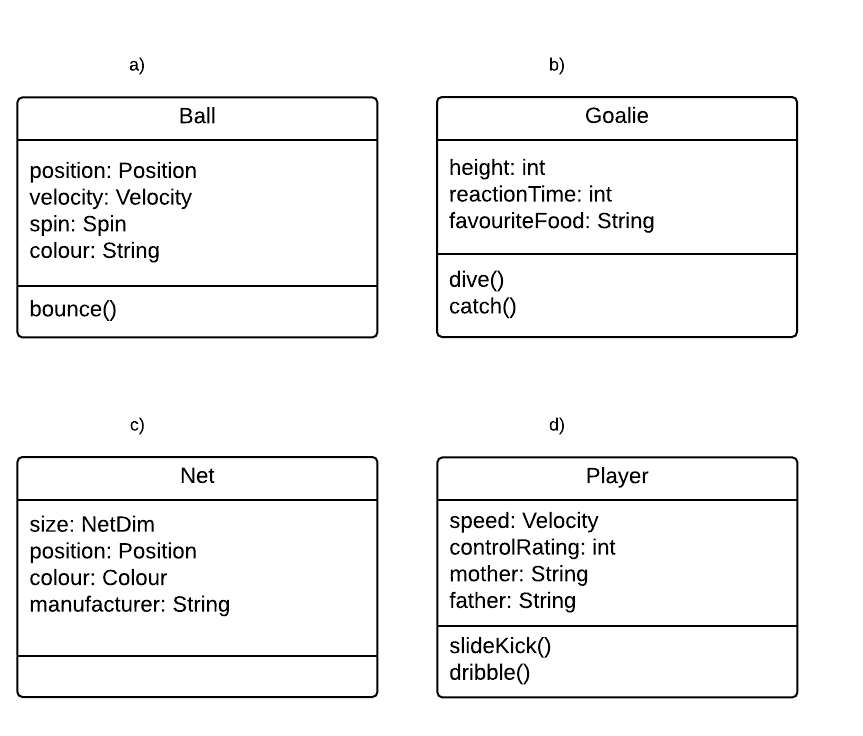
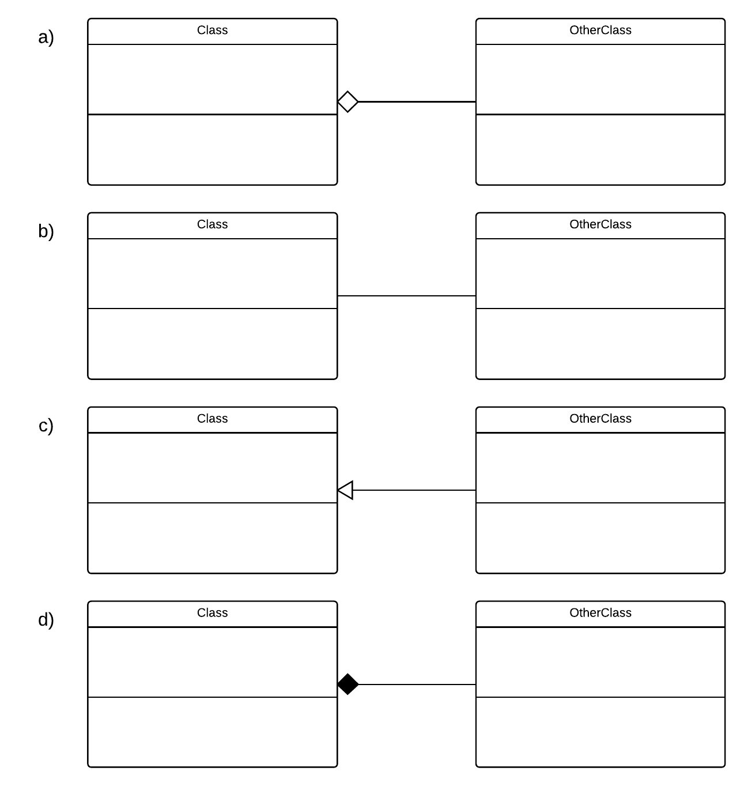
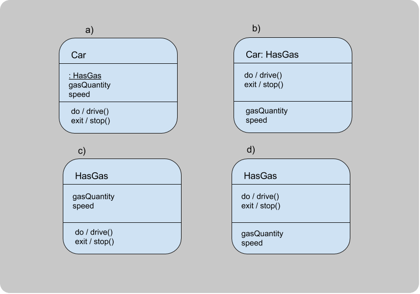
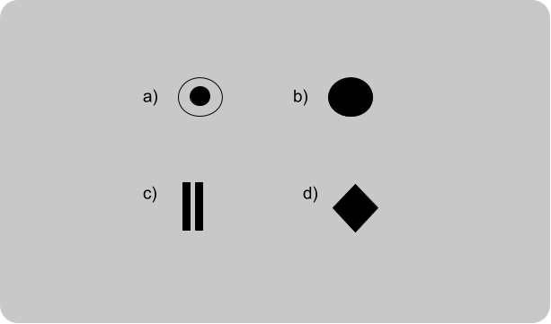

```
  # Do not copy if you are taking the test.
```
--- 

# Module 3 Review 
 

### 01. The first stage of the two-stage design process is  _______ design.

Hint: This stage has activities like creating CRC cards, talking with the customer about their requirements, and creating mockups. 
```
conceptual
```


### 02. The second stage of the two-stage design process is ________ design. 

Hint: This is when you will define the structure of the code and start turning your mockups into classes. 
```
technical
```


### 03. Which of these conceptual design techniques will help you analyze the problem space to determine classes for your object-oriented software? Choose the two correct answers. 
  
- [ ] tradeoffs  
- [ ] requirements  
- [x] CRC  
- [x] mockups  


### 04. During conceptual design, once the problem is mapped into components, what are the other two critical pieces of information that you must specify for these classes or components? Choose the two correct answers.  
  
- [x] responsibilities  
- [x] collaborators  
- [ ] abstract data types  
- [ ] methods


### 05. You are writing the CRC card for a Bear component. Choose the two responsibilities. 

- [ ] camper  
- [x] eat berries  
- [ ] den  
- [x] hunger  


### 06. You are writing the CRC card for a Bear component. Choose the three collaborators.  
  
- [x] den  
- [ ] guitar  
- [x] bear  
- [ ] computer  
- [x] tree


### 07. You create an object that represents a user, storing important information about them such as their preferences. What kind of object is this?  
  
- [ ] boundary  
- [ ] client  
- [x] entity  
- [ ] control 


### 08. You create an object that represents a dialog box. It creates buttons and text fields, etc, for the user to interact with, and it logs those interactions. What kind of object is this?
  
- [ ] display  
- [x] boundary  
- [ ] interaction  
- [ ] entity  
- [ ] control 


### 09. You create an object that compares values from two different sources. It then updates the smaller value to be equal to the larger one. What kind of object is this?
  
- [ ] repository  
- [ ] entity  
- [x] control  
- [ ] update


### 10. Which of these is an example of a quality tradeoff?
  
- [ ] Adding preferences that allow users to switch some features on and off   
- [x] Adding security knowing it will reduce speed   
- [ ] Limiting features knowing that they can be added later  
- [ ] Not delivering key features so that deadlines can be met 


### 11. What is the term for reducing a class or object to its inputs and outputs in modelling?  
 
- [ ] pipe thinking  
- [ ] process thinking 
- [x] black box thinking 
- [ ] filter thinking  


### 12. Which one of these classes is in most need of being decomposed?
  
- [ ] Book  
- [ ] Order  
- [ ] Student  
- [x] Store  


### 13. Question 13
In order to provide good encapsulation, fill-in-the-blanks on this UML class diagram: (Replace the underscores `_` from top to bottom with minus signs ("-") or plus signs ("+"); your answer will be a string of six + or - signs with no spaces)  

```
--++++
```


### 14. You are writing a simple soccer video game. Select the best example of proper abstraction: 
 
  
- [a] a)  
- [ ] b)  
- [ ] c)  
- [ ] d)  


### 15. Which design principle enables developers to follow the guideline D.R.Y. ("Don't Repeat Yourself"):
 
- [x] generalization 
- [ ] encapsulation 
- [ ] decomposition 
- [ ] abstraction  


### 16. Which of these UML class diagrams shows an association relationship?  
 
  
- [ ] a)  
- [x] b)  
- [ ] c)  
- [ ] d)  


### 17. Which of these UML class diagrams depicts an aggregation ("has-a") relationship between the two classes?  
 
  
- [x] a)  
- [ ] b)  
- [ ] c)  
- [ ] d)  


### 18. Which of these UML class diagrams depicts a composition, or a strong "has-a" relationship?  
 
  
- [ ] a)  
- [ ] b)  
- [ ] c)  
- [x] d)   


### 19. Select the object pairing that has an association relationship:
  
- [ ] Coffee - Water  
- [x] Hiker - Trail  
- [ ] Tree - Root  
- [ ] Book - Page  


### 20. Select the object pairing that has an aggregation relationship:
  
- [x] Stapler - Staple  
- [ ] Book - Page   
- [ ] Car - Road  
- [ ] Pie - Crust  


### 21. Select the object pairing that has a composition relationship:
  
- [x] Book - Page  
- [ ] Record Player- Record   
- [ ] Tea - Sugar  
- [ ] Bear - Forest  


### 22. Choose the two answers that correctly complete the following sentence:

"We say that a class has low cohesion if..."

   
- [ ] ...it does not have all the necessary parts, i.e. it is incomplete.   
- [x] ...it tries to encapsulate too many unrelated responsibilities.   
- [ ] ...connects to many other classes.   
- [x] ...its purpose is unclear. 


### 23. Two classes are tightly coupled. What are some ways you might be able to tell? Choose the two correct answers.
  
- [ ] They can easily be swapped with different implementations of the same class  
- [ ] Their interactions are limited and controlled  
- [x] In order to understand one class, you need to open up the other to look at the implementation  
- [x] They are very highly reliant on each other  


### 24. How can you apply the principle of Separation of Concerns in object-oriented programming? 
  
- [ ] Split developers into teams that each deal with different parts of the software  
- [ ] Ensure classes are only concerned with their own data  
- [ ] Separate data and actions (methods) into different classes  
- [x] Separate objects or components according to their role in the software  


### 25. Which of these violates Liskov's Substitution Principle?
  
- [ ] subclasses specify the abstract methods of the superclass  
- [x] an operation in the superclass is replaced by a different operation in the subclass  
- [ ] the subclass adds behaviour  
- [ ] the superclass is too general  


### 26. For which of these situations would you use a sequence diagram?
  
- [ ] To show all of the different processes of your program.  
- [ ] To show the relationship between classes  
- [x] To show the collaborative behaviour of objects in your program.  
- [ ] To show the different modes that your program can be in.  


### 27. Choose the correct state diagram for a car which has a state called "HasGas:"
 
  
- [ ] a)  
- [ ] b)  
- [x] c)  
- [ ] d)   


### 28. Which of these elements represents a termination in a UML State diagram?  
 
  
- [x] a)  
- [ ] b)  
- [ ] c)  
- [ ] d) 


### 29. What is the purpose of model checking?
  
- [ ] To test for user-reported bugs  
- [x] To check the software for errors before release   
- [ ] To verify that the conceptual model of your software matches the customer's requirements.  
- [ ] To verify that the technical implementation matches conceptual mockups  


### 30. What is an abstract data type?
  
- [x] a type of data defined by the developer rather than the language.   
- [ ] a data type that cannot be used directly but must be implemented as an interface   
- [ ] a data-centric class  
- [ ] variables that are assigned a type (i.e. integer, double) but does not yet have a value assigned. 


--- 
> [Object-Oriented Design](https://www.coursera.org/learn/object-oriented-design) {Week-4}
