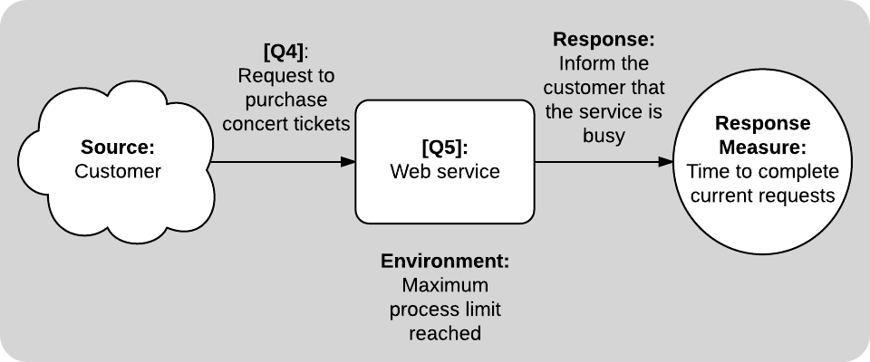
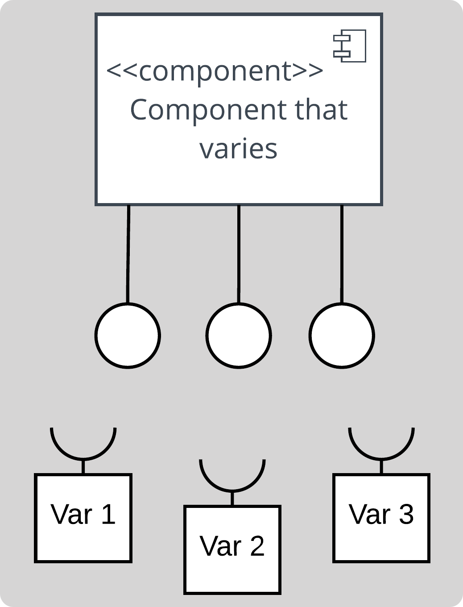

```
  # Do not copy if you are taking the test.
```
--- 

# Module 3 Review 
 


### 01. Identify the attribute refinements of a system's performance. Select the 2 correct answers.

- [x] latency 
- [ ] boot time 
- [x] throughput
- [ ] maintenance downtime
- [ ] simplicity


### 02. Guidelines such as "the system should be easy and intuitive to learn", "the system should minimize user errors," and "the system should make it easy for users to complete tasks" fall under which category of quality attribute?

- [x] usability 
- [ ] complexity
- [ ] intuitiveness 
- [ ] astonishment 


### 03. Calum is leading a team of developers and would like to promote conceptual integrity. Which of these is NOT a way he could promote conceptual integrity:

- [ ] Do regular code reviews with the development team
- [ ] Establish conventions, such as structural rules or naming conventions 
- [x] Split the development team into subteams for each component of the architecture 
- [ ] Adopt good documentation practices


### 04. Have a look at this diagram of a quality attribute scenario:

  

  **[Q4]** is a condition that will cause the system to respond. What is this called?  

- [ ] perturbation 
- [x] stimulus 
- [ ] error
- [ ] request


### 05. Let's look at the same diagram of a quality attribute scenario:

  

  **[Q5]** is the part of the system affected by the stimulus. What is this called?

- [ ] component 
- [x] artifact 
- [ ] context 
- [ ] process 


### 06. Which of these could be considered under the environment in a quality attribute scenario?

- [ ] send error to external system 
- [x] recovering from error
- [ ] internal subsystems 
- [ ] unrecognized system request 


### 07. Who are the three main groups of people involved in the architecture tradeoff analysis method?

- [ ] evaluation team, outsiders, project team 
- [x] evaluation team, project decision makers, architecture stakeholders
- [ ] clients, designers, stakeholders 
- [ ] peers, outsiders, designers 


### 08. Leon is analyzing the architecture and notices that under conditions of high numbers of users signing on at the same time, there is a potential that one of the architecturally significant requirements (ASRs) will not be met. What is this called?

- [ ] non-risk scenario 
- [x] risk scenario 
- [ ] utility shortfall 
- [ ] tradeoff 


### 09. Maddie's software team is split into two subteams working on two different components that work together. These teams share one large room and are in constant contact. According to Conway's Law, what could happen if Maddie does not physically separate the two subteams?

- [ ] Their components will repeat code unnecessarily
- [ ] They will not leave sufficient comments, thinking that the other team already knows the relevant details 
- [x] The components they produce will be very tightly coupled 
- [ ] The component interfaces will not be reusable 


### 10. This is one of the styles of implementing variations. What is it called?

   
  
- [ ] extension
- [ ] replacement 
- [ ] composition 
- [x] adaptation  


### 11. Which of these is NOT a typical advantage of developing a product line?

- [x] greatly reduced up-front development
- [ ] reducing time-to-market of later products
- [ ] consistency over the product line
- [ ] overall cost reduction 


### 12. Andy is planning the development of a product line of eBook readers and he has to categorize the components that will be handled by each team. There is one product in the line which has a backlight for reading during the night. In the development process, where would you categorize this feature?

- [ ] Variation 
- [ ] Commonality 
- [x] Product-Specific
- [ ] One-Off 


--- 
> [Software Architecture](https://www.coursera.org/learn/software-architecture) {Week-3}
